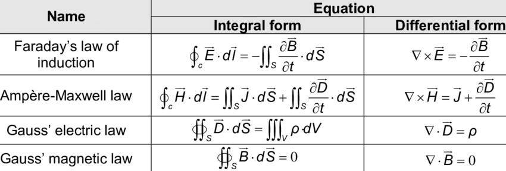

Unlike other physical sciences, astronomers don’t have access to the objects they study: it’s nearly impossible with current technology to actually go to nearby stars or planets for casual observation!

Nonetheless, the universe is the ultimate astronomy laboratory, and conveys tangible information in the form of light.

# What is light?

Light is a form of **electromagnetic radiation.** Let’s break down what that actually means:

- “Electro” = electricity: when protons (positive charge) and electrons (negative charge)
- “Magnetic” = magnets: tangibly, physical magnets attract and repel each other. This is because magnets produce a **magnetic field.** When magnetic objects enter a magnetic field, a force gets applied to them.

It turns out that **accelerating electric fields produce magnetic fields, and accelerating magnetic fields produce electric fields!** This behavior can be explained by a set of four equations, known as Maxwell’s Equations:

Some of the most awesome equations ever: but feel free to ignore for now; they will inevitably show up in a future math/physics class.

So, electric fields produce magnetic fields, and magnetic fields produce electric fields. Sometimes, it happens that they move at just the right speed such that they keep creating each other, forever. **This is light.**

## Speed of Light

You might notice that the image in the above section looks like an oscillating wave. We can describe this wave in two ways:

- Its **wavelength** $\lambda$ (lambda) is the distance from one crest to the next.
- Its **frequency** $f$ is the number of cycles the wave goes through in some period of time.

If we multiply the wavelength (distance) by the number of cycles over time, we can calculate the speed of light. This comes together into one convenient equation:

$$
\lambda f = v = c
$$

where $c$ is the speed of light, approximately $3.0 \times 10^8$ meters per second. 

Since the speed of light is constant, this means that **wavelength is inversely proportional to frequency.** In other words, the longer the wavelength, the shorter the frequency:

$$
f = \frac{c}{\lambda}\ ,\ \lambda=\frac{c}{f}
$$

## Spectrum of Light

**Why do we observe different colors?**

It turns out that each color is a different **wavelength** of light, with redder colors being **longer** wavelengths and blue/violet being **shorter** wavelengths.

The spectrum of light is actually one small portion of the entire electromagnetic spectrum:

Shorter wavelengths, like X-rays, carry more energy (and are therefore more harmful to humans). Longer wavelengths, like infrared radiation or radio waves, travel longer distances but carry less energy.

The major bands of the electromagnetic spectrum, by wavelength, are:

- $\gamma$ (gamma) rays: $\lambda$ < 0.01 nm (no limit)
- Xrays: about 0.01 - 10 nm
- Ultraviolet (UV): about 10 - 400 nm
- Visible (optical): about 400 - 750 nm
- Infrared (IR): about 750 nm-1mm (1000000 nm)
- Radio: $\lambda$ > 1mm (no limit)

## Particle-Wave Duality

As previously explored, light can be seen as a wave of constantly propagating electric and magnetic fields. But sometimes, the behavior of light cannot be fully explained by this alone.

### Photons

Something you might have heard of before is the concept of a **photon-** a particle that carries light energy. 

Photons have **no mass** and can carry discrete amounts of energy in them, which is described by the following equation:

$$
E = hf = \frac{hc}{\lambda}
$$

where $f$ and $\lambda$ are frequency and wavelength as before, $c$ is the speed of light, and $h$ is **Planck’s constant,** $6.626\times10^{-34} m^2 kg/s$. Planck’s constant is very, very small- so each individual photon carries an extremely small amount of energy!

### What’s wrong with waves?

Here are a few instances of light behaving weirdly:

- In 1905, it was observed that specific wavelengths of light hitting metal would cause the emission of electrons. (This is the **photoelectric effect,** which Einstein would later win the Nobel prize for explaining.)
- In 1922, the Compton Effect was observed: when light hits an electron, it bounces off in a different direction with a slightly longer wavelength.
- In the classic Double Slit experiment (pictured below), light is sent through two slits and is observed to hit a wall behind the slits. Depending on whether or not you measure the light entering a slit, you’ll either observe the particle pattern (like balls going straight through the slits), or the wave pattern (like waves in a pool going through a small slot).
    
    
    

### Particle Wave Duality of Matter

It actually turns out that when you observe light, it essentially acts like a particle, and when you leave it undisturbed, it acts like a wave!

In fact, this particle-wave behavior can be observed for **any form of matter.** It’s just that for objects with any substantial mass, the wavelength of its wave behavior is far too small to observe:

$$
\lambda = \frac{h}{mv}
$$

where $h$ is Planck’s Constant, $m$ is mass, and $v$ is speed.