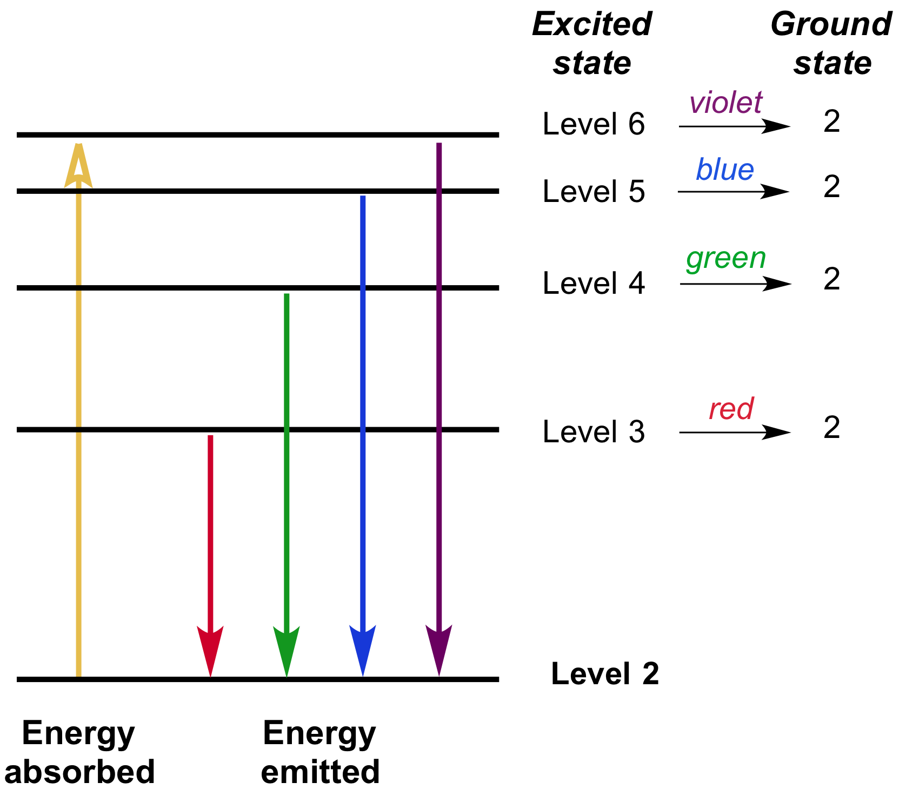

# The Spectra of Elements

Every element on the Periodic Table has unique configuration of electron energy states. Here are some rules, as discovered through quantum physics:

- Every electron has a **discrete** energy level.
- Electrons can exist on one of several energy levels.
- If a photon (particle of light) hits an electron, the photon can **absorb** the proton and get excited, jumping up to a new energy level. **This only occurs if the photon’s energy level exactly matches the energy difference between two discrete states.**
- If left undisturbed, excited electrons will **emit** photons, jumping down to a lower energy states. This is why certain elements appear to glow in different colors when heated.

## Spectroscopy

Spectroscopy is the study of the absorption and emission of electromagnetic radiation. Through spectroscopy techniques, we can determine the composition of distant stars based on the light that reaches us from them.

**So, how do we determine what stars are made of?**

When we measure the light coming from stars, we can find out that they emit imperfect spectra: at particular points in the spectrum, there are **spectral lines,** or spikes/dips from the expected amount. 

**Spikes represent emission, and dips represent absorption.** These are observed because light emitted by the star must first pass through the elements (clouds of gas, typically) that exist in the star. When they do so, these gases will interact with the photons based on their unique configurations of energy states. When we match the spectral lines with known lines determined by observing the light emitted by elements on Earth, we can determine the composition of the star!

### Gas Clouds

Suppose a cool cloud of gas exists next to a hot, bright star:

The star produces a continuous spectrum of light. When the light enters the gas, the gas will absorb its energy, and emit only spectrum lines. As a consequence, **the light observed depends on the orientation of the observer:**

- If you look directly at the star through the cloud of gas, then you see a continuous spectrum with missing absorption lines.
- If you look straight down at the cloud of gas (star is not in line of sight), then you will only see the spectrum lines.
- If you look at the star without looking through the cloud of gas, then you will see a continuous spectrum.

# The Doppler Effect

If you’ve ever heard the sound of an ambulance or honking car pass by, you might have noticed that the sound gets lower pitched after they pass you! This is known as the **Doppler Effect:**

[https://www.youtube.com/watch?v=AJ5ZnnXpPfc](https://www.youtube.com/watch?v=AJ5ZnnXpPfc)

In the case of sound, the reason why it gets lower pitched is because waves emitted from a moving object end up being closer together when the object is moving towards you, and further apart when the object is moving away. (The speed of the wave gets either added or subtracted from the speed of the object.) 

This phenomenon also occurs with light, since light has wave-like properties! When light emitted from a moving object reaches us, it will either be:

- **Red-shifted** if the **wavelength increases** and the frequency decreases as a result of the object moving away, or
- **Blue-shifted** if the **wavelength decreases** and the frequency increases as a result of the object moving towards us.

Based on the extent to which their emitted spectrum is shifted to smaller or larger wavelengths compared to the expected spectrum, we can use the following equation to determine how fast stars are moving relative to us:

$$
\frac{\lambda - \lambda_0}{\lambda_0} = \frac{\Delta \lambda}{\lambda_0} = \frac{v}{c}
$$

In this equation:

- $\lambda$ is the observed wavelength,
- $\lambda_0$ is the expected wavelength (of a stationary object),
- $v$ is the velocity of the object relative to us,
- $c$ is the speed of light,
- $\Delta \lambda$ is the **change** in wavelength.
    - If it’s **positive**, then the observed wavelength is **longer** than expected, which signifies a **red-shift** and thus the object is moving **away** from us.
    - If it’s **negative**, then the observed wavelength is **shorter** than expected, which signifies a **blue-shift** and thus the object is moving **towards** us.

Technically, the Doppler shift equation is *slightly* inaccurate due to the relativistic effects of speed on distance and time. However, it is a very good approximation for objects moving relatively slowly compared to the speed of light.

# Luminosity

The higher the frequency, the more energy something has.

The higher the energy, the hotter something is.

The hotter something is, the brighter it is.

All of these ideas are combined into one equation, known as the **Stefan–Boltzmann** **equation:**

$$
L = 4\pi R^2\sigma_{SB}T^4
$$

- $L$ is the luminosity of a blackbody (how much energy it emits),
- $R$ is the radius of a blackbody,
- $T$ is the temperature of a blackbody,
- $\sigma_{SB}$ is the Stefan-Boltzmann constant, $5.67 \times 10^{-8} W \cdot m^{-2} K^{-4}$.

The constants are not too important for understanding this equation; what is most important is that **luminosity is proportional to the radius squared, and temperature to the 4th power.** So, a star that’s twice as large as another will emit 4 times more energy, and a star that’s twice as hot as another will emit 16 times more energy.

One interesting consequence of this is that since the color blue has a higher frequency than the color red, **blue stars are hotter than red stars.** This goes against traditional color-coding (where blue is cold and red is hot)!