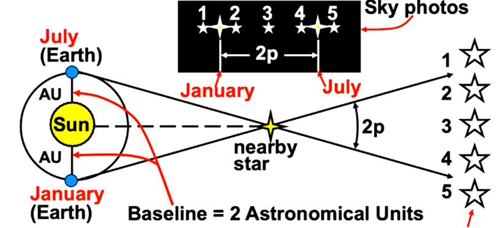

## Parsecs

Parallax: angle subtended (covered) by 1 AU

As the distance from Earth to a star increases, the parallax decreases.

The distance for which 1AU has a one arcsecond parallax is called a parsec (pc). A parsec is about 3.26 light years.

Distance in parsecs = reciprocal of the parallax in arcseconds

## Stars

$b = \frac{L}{4\pi d^2}$: the apparent brightness of a star, by the inverse square law, decreases by the square of the distance you move away from it.

The luminosity of the sun is about $L_\circledcirc =4 \times 10^{33}$ ergs per second.

In a binary star system, $m_1 r_1 = m_2 r_2$ where $m$ is the mass of each star and $r$ is the distance to the center of mass of the system.

Fusion occurs when $T > 10^7 K$ and $M > 0.08\ M_{\circledcirc}$.

For main sequence stars, luminosity is roughly proportional to $M^4$ (the mass of the star).

The time a star lives is approximately proportional to $\frac{1}{R^3}$ (L = energy over time, $E=mc^2$, solve for $t$).

### The Hertzsprung-Russell Diagram

Hertzsprung-Russell (temperature-luminosity) diagram

- Main sequence stars typically burn hydrogen into helium
- The Sun is a main sequence star (middle bottom right)
- White dwarfs: no fusion, very dense remnant of star after gases have burnt away

A star cluster with fewer star types is older due to its main sequence turnoff point getting further down in the HR diagram.

### Types of Stars

What are the different types of stars?

- Stars are classified by their surface temperatures. O class stars are the hottest.
- The Sun is a G-class star.
- **Main-sequence stars** are typical stars that undergo nuclear fusion (like our Sun). Young stars tend to be hotter (O, B, A, F stars).
    - The age of a star cluster can be determined by the types of stars in it. Older clusters lack more of the hotter classes: for instance, a cluster with no O,B,A, or F stars would be older than one without O or B stars only.
    - Globular clusters are distributed in a spherical halo in a galaxy, and consist of old stars. They can be 100k+ stars in size.
    - Open clusters are distributed in the spiral arms of a galaxy and consist of around 100 new stars.
- Stars with less than 0.08 solar masses are too small to sustain fusion, so they become brown dwarfs. They are held up by electron degeneracy pressure.

### The Life of a Star

What does the life of a star look like?

- Stars are born when nebulae (clouds of dust and gas) become dense enough that they collapse into a point. When it gets hot enough at the center of that point, nuclear fusion begins, and the star is born!
    - The three main types of nebulae are:
        1. Emission Nebulae: A hot cloud of glowing gas that is ionized by UV light from nearby hot stars
        2. Reflection Nebulae: a dust/gas cloud that scatters light from adjacent stars
        3. Dark Nebulae: a large, dense cloud of dust/gas that absorbs and blocks light
- The nuclear reactions provide mechanical balance (hydrostatic equilibrium) between fusion pressure and gravity, meaning that stars’ temperatures and luminosities don’t actually change that much while it remains on the main sequence.
- For main sequence stars, luminosity is roughly proportional to $M^4$ (the mass of the star). More massive stars burn out faster.

    The time a star lives is approximately proprtional to $\frac{1}{R^3}$(L = energy over time, $E=mc^2$, solve for $t$ to get approximately how long the star will live for.

- As stars grow older, the hydrogen that they burn turns into heavier and heavier elements until the fusion pressure pushes outwards, causing the star to expand into a red giant. Red giants have cooler surface temperatures, but become many times larger than original. This is when stars move up and to the right in a H-R diagram (lower temp, higher luminosity).
    - Some smaller stars will eventually become white dwarfs, which are about the size of Earth but extremely dense and made up of heavy elements.

## Supernovae

What are the different kinds of supernovae?

- A Type Ia supernova is the explosion of a white dwarf in a binary system when enough matter falls onto it from its companion that the white dwarf gets close to the “Chandrasekhar limit,” about 1.4 solar masses. (Also, two white dwarfs in a binary system can merge, or two white dwarfs can collide.) This is the limiting mass of a white dwarf, and when (or just before) reaching it the white
dwarf undergoes a runaway chain of nuclear fusion reactions, completely obliterating
the star. The supernova glows for a few months because of the subsequent decay of
radioactive isotopes of nickel and cobalt.
- A Type II supernova is the explosion of a massive star (more than about 10
solar masses) when it runs out of nuclear fuel in its core. The core, which consists of
iron at this point and cannot release energy by nuclear fusion, collapses as the protons
and electrons combine to form neutrons and neutrinos. The collapse subsequently
rebounds and blows off most of the original star, leaving behind only a compact
neutron star. A flood of neutrinos is released, and they are actually more effective
than the “bounce” in blowing off the material outside the star’s core.

## Neutron Stars and Black Holes

What are neutron stars and pulsars?

- Neutron stars are the remnants of Type II supernovae: an ultra-dense core of free neutrons.
- Pulsars are a specific type of neutron star that are highly magnetized and rotating in such a way that their brightness is seen as regular bursts.

What is Einstein’s general theory of relativity?

- Matter and energy warp space and time, causing the paths of objects and light to curve.
- Three famous tests for relativity include:
    - Observing that Mercury’s orbit precesses (major axis rotates) differently than predicted from classical physics.
    - Starlight is deflected slightly by the Sun.
    - Light is redshifted as it comes out of a gravitational field.

What are black holes?

- Neutron stars having $M \ge 2-3 M_{\circledcirc}$ (exact limit not yet known) collapse due to neutron degeneracy pressure of packed neutrons in the same quantum state pushing each other apart.
- A black hole forms if $R \le R_S = \frac{2GM}{c^2}$ (Schwarzschild Radius)
- Gravity is so strong that nothing, including light, can escape (i.e. escape velocity = $\infty$)
- May also form in very massive stars who have cores similar to those of neutron stars (20 to 100 solar masses)

What are some properties of black holes?

- Gravitational redshift: photons close to (but outside) a black hole are bent and redshifted due to curvature in spacetime
- Black holes with low mass have significant tidal forces due to the fact that the gravitational force closer to it is considerably greater.
- Photon sphere at $R = \frac{3GM}{c^2}$ (1.5 times Schwarzschild radius): light can orbit the black hole
- If you watch someone fall into a black hole:
    - Their time would seem to get slower, and eventually come to a stop (infinite time dilation inside of black hole)
    - It would appear that they would never fall in
    - Over time, they would be gradually more redshifted and faded, then eventually disappear
- Ergosphere: the radius around a black hole in which rotational energy can be recovered
- According to classical physics, there are only three possible quantities that can be measured for
a black hole from the outside: its mass, spin (angular momentum), and charge. (In
practice, we don’t even expect black holes to be charged, because they will quickly
attract the opposite charge and become neutral.) You can’t tell what actually went
into the black hole; the details are lost.
- Black holes can evaporate from Hawking radiation, eventually ending in an explosion of gamma rays.

How do we detect black holes if we can’t see them?

- We can measure its gravitational influence: if a planet or star is influenced by a very massive object but we can’t directly observe that object, then it is likely it’s a black hole.
- We can also measure gravitational waves created from formation and merging of black holes.

## Dark Matter

What is dark matter?

- Dark matter is any matter that we can’t see or detect with current means. Candidates for dark matter include black holes, neutron stars, white dwarfs, brown dwarfs, free-floating planets, and other MACHOs (massive compact halo objects).
- Dark matter may also include more exotic matter, like neutrinos, axions, and weakly interacting massive particles.

## Contents of the Universe

- Stars and visible gas: 0.5%
- 4.5% normal dark matter (protons, neutrons, electrons; things that don’t emit visible light)
- 25% exotic dark matter
- 70% dark energy