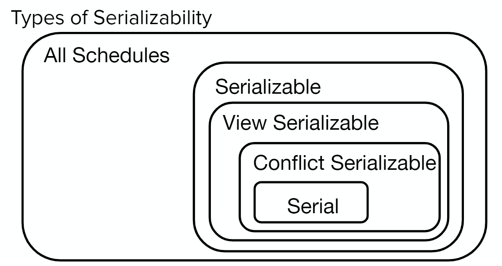

## What is a transaction?

Transactions are collections of operations that can be treated like a single unit. The primary reason why we need transactions is to obey the **ACID** properties:
- **Atomicity:** either all operations happen, or none of them
- **Consistency:** database remains in a consistent state with its constraints (for example, primary keys will never be null)
- **Isolation:** it should appear as if we only run 1 transaction at a time (even if they’re actually run concurrently)
- **Durability:** once a transaction commits, it persists

Transactions support two main operations:
- COMMIT: indicates a successful transaction, changes should be saved
- ABORT: indicates an unsuccessful transaction, changes should be reverted

## Relevant Materials
 - [Note 11](https://notes.bencuan.me/cs186/coursenotes/n11-Xact1.pdf)
 - [Note 12](https://notes.bencuan.me/cs186/coursenotes/n12-Xact2.pdf)
 - [Discussion 8](https://docs.google.com/presentation/d/1nbqCBb3H-UZSKJLm3INSS3-rhTNw8vWJti9wlcXL2uI/edit)

## Serializability
As previously mentioned, transactions must be treated like a single unit, even if they are actually made up of many smaller operations. However, it's often inefficient to only run one transaction at a time-- whenever a transaction tries to read something from the disk, we can start running another transaction while waiting for the data to be retrieved.

We can create a **schedule** to determine the order in which we execute operations in a set of transactions. A **serial schedule** is a schedule in which every transaction completes without interleaving (finish all parts of one transaction from start to finish before moving to the next) - ideally, we would want all schedules to approximate a serial schedule.

Formally, **Two schedules are equivalent if:**
- They involve the same transactions
- The final state after all transactions is the same
- Each transaction’s operations are completed in the same order
  
  In order to check serializability, we will check if they are **conflict serializable:**
    - Two operations are in a schedule conflict if
        - at least one operation is a write
        - the operations are on different transactions
        - the operations work on the same resource
    - Two operations are conflict equivalent if every conflict is ordered in the same way.
    - A schedule is conflict serializable if it is conflict equivalent to a serial schedule.
- **View serializability** refers to conflict serializability in which blind writes (intermediate writes that are overwritten without a read in between) are ignored. Checking view serializability is an NP complete problem.

In summary:

### Conflict Dependency Graphs

To draw a conflict dependency graph for a schedule, represent each transaction as a node. Then, draw an arrow from an earlier operation to a later operation if **the two operations are done in different transactions, and at least one of the operations was a write.**

To find equivalent schedules, run topological sort on all involved graphs. **All conflict serializable schedules have an acyclic dependency graph.** So if a graph has a cycle, it is not conflict serializable.

## Locking

If two transactions need to access the same data, we need a way to guarantee isolation! The solution is for a transaction to **lock** a resource if it needs access to it. Then, other transactions should wait until the lock is released before accessing the same resource.

A transaction may lock a resource in two primary ways:
- **S lock** (shared): allows a transaction to read a resource
    - Multiple transactions can hold S lock on the same resource at the same time
- **X lock** (exclusive): allows a transaction write a resource
    - No other transaction can have any type of lock on the same resource as a transaction with an X lock on it

Here's the **lock compatibility matrix** for S and X locks:
    

### Two Phase Locking (2PL)

2PL is one method of enforcing conflict serializability.

There are two phases:
1. From start until a lock is released, the transaction is only acquiring locks (acquiring step)
2. From after a lock is released to the end of the transaction, the transaction is only releasing locks (release phase)

Transactions cannot acquire any lock after it has released a lock.

**Strict 2PL** only allows releasing of locks at the end of the transaction. This avoids cascading aborts (when unrelated transactions are aborted due to lock release schedule).

## Deadlock

Deadlock occurs when there is a cycle of transactions all waiting for each other to release their locks.

### Deadlock Avoidance

Deadlock avoidance is the process of catching deadlocks before they occur. There are two main ways we can avoid deadlock:
- **Wait-die:** if $T_i$ wants a lock but $T_j$ holds a conflicting lock:
    - If $T_i$ higher priority, wait for $T_j$ to release
    - If $T_i$ lower priority, abort (die)
- **Wound-wait:**
    - If $T_i$ is higher priority, $T_j$ aborts
    - If $T_i$ is lower priority, it waits for $T_j$ to finish
- If no explicitly defined priority, we can assign priority by age (current time - start time).

### Deadlock Detection
Deadlock detection refers to the process of detecting and resolving deadlocks when they occur.

To perform deadlock detection, we can draw a **waits-for graph**:
- One node per transaction
- If $T_i$ holds a lock that conflicts with the lock that $T_j$ wants (i.e. $T_j$ waits for $T_i$), add an edge from $T_j$ to $T_i$. (Check the lock compatibility matrix to see what lock types conflict).
- Deadlock occurs if there is a cycle in the graph

Waits-for graphs are very similar to conflict dependency graphs, except that **rather than older operations pointing to newer ones, newer operations point to older ones.** This is because the later operation "waits for" the older one to complete.

## Multigranularity Locking

- Tuple-level locking: one lock per tuple (high locking overhead due to a scan requiring many locks)
- Table-level locking: one lock per table (low concurrency since any update locks the entire table)
- **Multigranularity Locking:** based on operation, allow for different types of locks
    - Scans = lock entire table = lower overhead
    - Update tuple = lock only the affected tuple = higher concurrency
    - For each lock, transactions must hold **intent locks (IX, IS)** at all higher levels of granularity
        - Indicate a future requirement to lock at a higher level
        - Example: If S lock on tuples is requested, we need intent locks on database, table, and page
        - IX = intent to acquire exclusive lock on lower level
        - IS = intent to acquire shared lock on lower level
        - SIX = shared + intent to acquire exclusive lock at lower level. (equivalent to having both S and IX locks - can read entire table and acquire X locks when needed)
        - In order to acquire S, a transaction must also have the IS lock (same for X)

## Practice Problems



(Fall 2022 MT2) Draw the conflict dependency graph for the following schedule. Is this schedule conflict serializable?



To draw the conflict dependency graph, remember the rule of drawing an arrow from an earlier operation to a later operation if the two operations are in different transactions and at least one of them was a write:

Then, we compress all of the arrows into their corresponding transactions, resulting in the following graph:

Since there is a cycle from T2 to T5, this schedule is **not conflict serializable**.





(Spring 2022 MT2) Suppose we wanted to read the entire Page 1. What locks should we hold on each layer after granting the lock?

Here is the original state:




Right now, we can't read Page 1 since we don't have an S lock on it. Therefore, we need to promote the IX lock on Page 1 into an SIX lock.

Since an S lock exists on Page 1 now, Tuple 1 can release its S lock (no S in S descendants).

Everything else remains the same, so the following locks will be held:
 - Tuple 1: NL
 - Tuple 2: X
 - Page 1: SIX
 - Table: IX
 - Page 2: X

