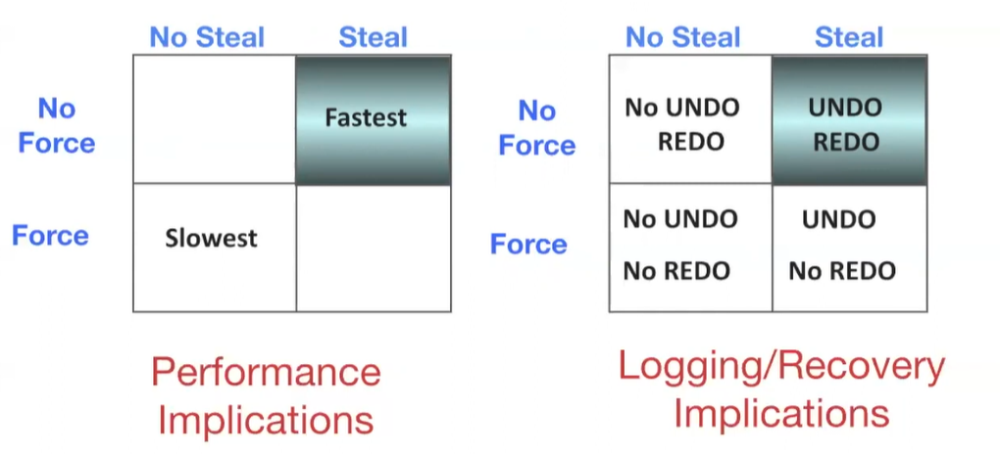

## Introduction

**Recovery** is the process of making databases resilient to failure. Specifically, recovery enforces **durability** (a committed transaction remains persistent) and **atomicity** (either all of the operations in a transaction complete, or none of them).

**Assumptions:**
- We use strict two-phase locking for concurrency control.
- Updates happen in-place: transactions that modify data overwrite entries in the database.

## Relevant Materials
 - [Note 13](https://notes.bencuan.me/cs186/coursenotes/n13-Recovery.pdf)
 - [Discussion 9](https://docs.google.com/presentation/d/1K9BNas4NYQbRSB8q_EswPepjwVj-cijxQOsZEIYTNsY/edit?usp=sharing)

## Steal/No Force

### No Steal Policy

Don’t allow buffer pool frames with uncommitted updates to be replaced or flushed to disk.
- Achieves atomicity
- Can cause poor performance due to pinned pages limiting buffer replacement

### Force Policy

Before commit, ensure that every update is forced onto the disk.
- Achieves durability
- Can cause poor performance due to high random IO

A simplistic attempt at recovery (that doesn’t actually work) would be to combine no-steal and force. This doesn’t work because it doesn’t guarantee atomicity if the DB crashes while writing dirty pages.

### Steal No-Force Policy

Steal No-Force is the most efficient approach, but also complicated:
- No Force: flush dirty pages as little as possible, and only when convenient, before commits. Allow for redoing modifications. (Can complicate durability)
- Steal: allow buffer pool frames to be replaced whenever convenient. (Can complicate atomicity)

## Logging

**Main idea:** for every update, record info to allow undoing and redoing.

A log is an ordered list of records.

- Each record contains:
    - Transaction ID
    - Page ID
    - Offset
    - Length
    - Old Data
    - New Data
    - Additional control info
- A log also contains a write buffer (tail) in RAM.
- Each log record has a unique, increasing log sequence number (LSN).
- The log tracks `flushedLSN` that tells us the most recently flushed log record.
- Each data page in the database contains a `pageLSN`, a pointer to the most recent log record for an update to that page.

**Write Ahead logging protocol (WAL):**

- Log record must be written for an update before the corresponding data page is written to disk (allows atomicity with UNDO info)
- All log records must be stored for a transaction before commit (allows durability with REDO info)
- **Invariant:** before page `i` is flushed to the DB, `pageLSN <= flushedLSN`. i.e. all log records for the page need to be flushed before the page itself can be flushed.

### ARIES Log Records

ARIES  (Algorithms for Recovery and Isolation Exploiting Semantics) is a logging algorithm. Some details:

- Every log record contains `prevLSN`, which is the previous log record written by this transaction. This helps us undo a chain of operations.
- Log records can be several types:
    - Update, commit, abort
    - Checkpoint (for log maintinence)
    - Compensation Log Records (CLRs) for undo actions
    - End (of commit or abort)
- Two in-memory tables are created:
    - Transaction table contains one entry per active transaction. When a transaction commits or aborts, it is removed.
        - Contains transaction ID, status (running, committing, aborting) and lastLSN columns.
    - Dirty page table contains one entry per dirty page in the buffer pool.
        - Contains page ID and recLSN (log record that first caused the page to be dirty).
        - recLSN stands for “recovery LSN”: the first timestamp in which the page is dirty.

### ARIES Checkpoints

**Main idea:** save the state of the database periodically so we don’t need to process the entire log during recovery.

A checkpoint consists of the following:

- Stop accepting any new transactions
- Wait until all current transactions complete (commit or abort)
- Flush log to disk
- Flush all dirty pages to disk
- Write a CKPT log record
- Flush log again
- (At this point, all commits are written, and all aborts have been rolled back)
- Resume processing transactions

This is very slow because the database freezes during checkpoint creation. **Fuzzy checkpointing** attempts to resolve this issue by saving the state of all transactions and page statuses, but does not stop any transactions or flush dirty pages.

- Keep track of transaction states (transaction table) and dirty page table
- Save the above to disk
- When recovering, recreate the above from the log, recreate running transactions and dirty pages in memory, then replay the rest of the log.

Specifically, the following happens:

- Write a BEGIN CKPT to log
- Flush log to disk
- Continue normal operation
- When DPT and transaction tables are written to disk, write END CKPT to log

### ARIES Normal Operation

**Start Transaction:**``
- Write START to log
- Update transactions table with new transaction
- Set the following values
    - `prevLSN = lastLSN` in log
    - `pageLSN = LSN` in buffer pool
    - `lastLSN = LSN` in transaction table
    - If `recLSN` is null, then set it to `LSN` (i.e. first time this page is dirty)

**Flush Page:**
- Flush log up to and including `pageLSN`
- Remove page from DPT and buffer pool

**Fetch page:** 
- Create new entry in DPT and buffer pool

**Commit:**
- Write commit record to log
- Flush log up to entry
- Update transaction table status to commit

**Abort:**
- Write abort record to log
- Find first action to undo from `lastLSN`
- Start to undo changes
- Write compensation record (CLR) to log, and set is `undoNextLSN` to the next record to undo
- Follow `prevLSN` like a linked list pointer to find next value(s) to undo
- When the last action has been undone, change the transaction status to Abort

## Crash Recovery

### Summary
- Start from a checkpoint from the master record
- Analysis phase: figure out which transactions committed and which ones failed
- REDO phase: repeat the history of the log and reconstruct the state of the database before the crash.
- UNDO phase: undo effects of failed transactions.

### Analysis Phase

- Re-establish knowledge of state at checkpoint via transaction table and dirty page table stored in the checkpoint.
- Scan log forward from the checkpoint.
    - End record: remove transaction from transaction table
    - Update record: if page is not in DPT, add it to the DPT and set its `recLSN` to `LSN` (current log record being scanned).
    - Else: add transaction to transaction table, set `lastLSN` to `LSN`, then change the transaction status on commit or abort.
- After analysis ends:
    - For every transaction in the committing state, write a corresponding END record and remove it from the transaction table.
    - The transaction table now displays which transactions were active at the time of crash. Set all of these to aborting status and write abort records.
    - The DPT now shows which dirty pages might not have made it to disk.
    

### REDO Phase

- Scan forward from the log record containing the smallest `recLSN` in the dirty page table.
    - Checkpoints don’t actually save data, so we have to replay all of the actions that didn’t necessarily make it onto disk. `recLSN` tells us when the log and disk diverges.
- Cases where we don’t want to redo:
    - **Main idea:** The point of REDO is to replay transactions. If an operation has already made it to disk, we don’t need to redo it.
    - Affected page is not in DPT (page was flushed and removed before checkpoint)
    - Affected page is in DPT, but `recLSN > LSN` (page was flushed and removed from DPT, then referenced again and reinserted into DPT later on)
    - `pageLSN >= LSN` (page was updated again and flushed after the log record)
- If we do want to redo:
    - Reapply the logged action.
    - Set pageLSN to LSN with no additional logging.

### UNDO Phase

- The transaction in the transaction table after analysis should abort.
- Do one backwards pass of the entire log, and undo sequentially.

### What happens if DB crashes during crash recovery?
Nothing! Crash recovery is inherently durable, because it still follows the same rules as write-ahead logging in that log records are always written before any changes are made. If recovery doesn't complete, then we can simply start over from the beginning of recovery and try again.