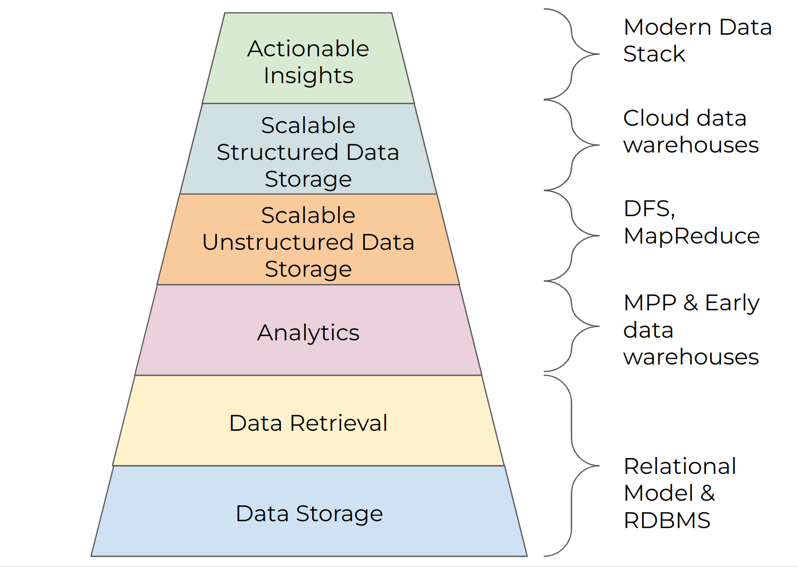

# Extras

# Databases at Uber

### Postgres

Postgres is a popular open-source SQL relational DBMS that supports:

- ACID transactions
- B-tree with indices
- Query optimization
- Parallelization
- Write-ahead logging
- Replication
- PostGIS geospatial support

Some properties of Postgres:

- Tuples are immutable, so we need to create a new version of a row every time we update it. All rows contain a version ID and a pointer the previous version. Old row versions may be deleted via autovacuum.
- Every tuple is uniquely identified by a ctid (on-disk location)

Problems with Postgres: 

- **Write amplification:** Applying a small logical change requires a very large update due to writes and updates needed to support the write
- **Replication Amplification:** Distributed DBs need to send very large WALs between servers- high bandwidth cost

### MVCC

Multi-version concurrency control: concurrent transactions operate on different versions of data, and are guaranteed isolation+consistency 

Pros:

- Conflicting reads or writes don’t block each other
- Isolation without locks
- View consistency of at least one data snapshot

Cons:

- Versions can be outdated
- Increased storage to handle multiple versions
- Requires periodic cleanup of old versions
- Replica MVCC Delay (high IO cost of supporting all of the above)

### MySQL

MySQL differs from Postgres in that data is mutable, and it uses different indexing, replication, and storage strategies.

# The Modern Data Stack

