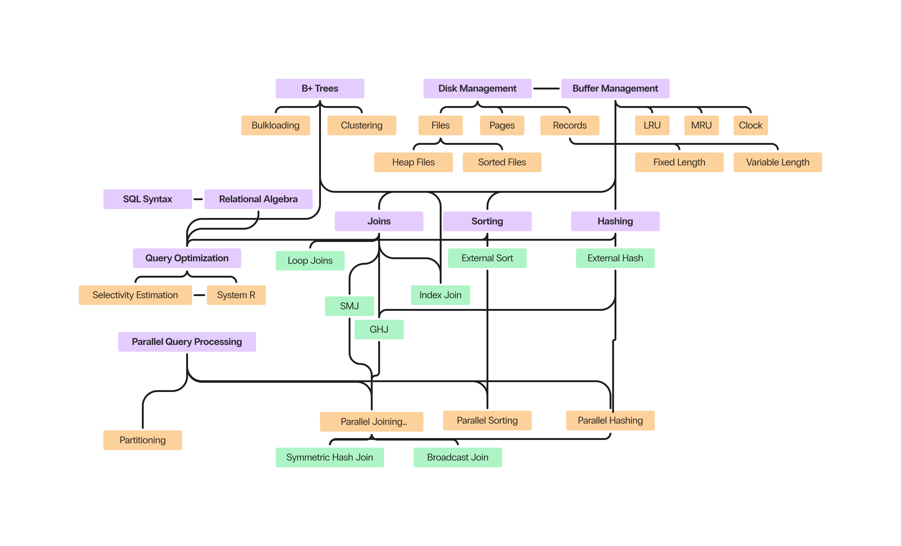
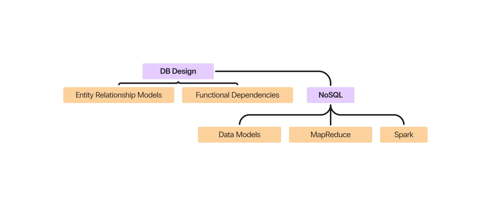
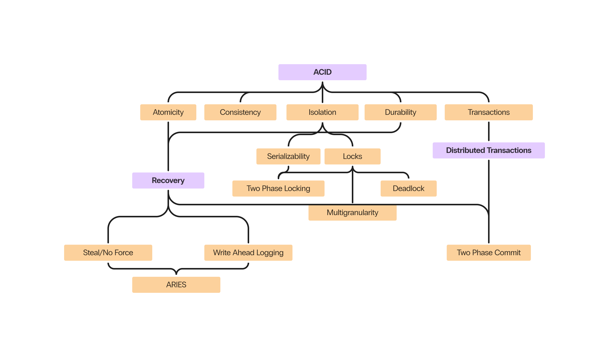

# Welcome to my CS186 Guide!

This is a **non-comprehensive** guide to databases written with an intention to supplement learning and reviewing of Berkeley's [CS186](https://cs186berkeley.net) material. Main topics include:

* [SQL syntax](<cs186/00 SQL Basics>)
* [How to improve popular sorting and hashing algorithms to work well with limited memory](<cs186/04 Sorting and Hashing>)
* [B+ trees](<cs186/02 B+ Trees>) and other advanced indexing structures
* [Join algorithms](<cs186/05 Iterators and Joins>)
* [Query optimization](<cs186/07 Query Optimization>)
* [Parallel query processing](<cs186/09 Parallel Query Processing>)
* [Crash Recovery (AERIES)](<cs186/10 Recovery>)
* [Database transactions and Concurrency](<cs186/08 Transactions>)
* [Entity-Relationship Diagrams](<cs186/12 ER Diagrams>)

I recognize that the course notes for 186 can be *very* dense sometimes, and don't cover 100% of the information you need to do well on projects and exams. While this also doesn't covery everything, I try to focus on content that the notes don't.

**This isn't a replacement for lectures and other course content.** You probably need to look at those first, and come here if something isn't sticking!

> [!important] Please read this first!
> 
> [What is an I/O and why should I care?](io)

## Disclaimer

Although I am a 186 TA, these notes are not official course content. They have not been reviewed or approved by an instructor, and there may be inaccurate or missing information. Please don't bother the other course staff with questions about the content here- contact me instead (email or office hours).

## Concept Maps

### Database Implementation

### Database Design

### ACID

## Prerequisites

CS 186 projects are done in Java. Knowledge of [CS61B](/cs61b) concepts are assumed. Specifically, you should understand:
 - OOP fundamentals such as classes, inheritance, and objects and implement them in Java
 - Binary trees, their runtime proprties, and implementation of efficient search and insert algorithms
 - Basic hashing and sorting algorithms
 - Use an IDE (preferably IntelliJ or VSCode) and its debugger to step through code and create breakpoints

In addition, knowledge from the last part of [CS61C](https://cs61c.org) is assumed and will be very useful for the first part of 186. This includes:
 - Knowing how computers store memory, the different types of memory (disk, RAM, cache), and why we have them
 - How data is stored on disk (files, pages, records)

Unsure about prerequisite content? You can review my [CS61B notes](/cs61b) if needed. I'll cover the main points from 61C at the start of [Disks, Buffers, Files](cs186/01%20Disks,%20Buffers,%20Files.md).

## How to contribute

See the [contributing guide](/contributing) for more details!

Two particular additions that need to be made are entries for Functional Dependencies and NoSQL. I don't have notes written for this since these topics were not covered when I took the course.

