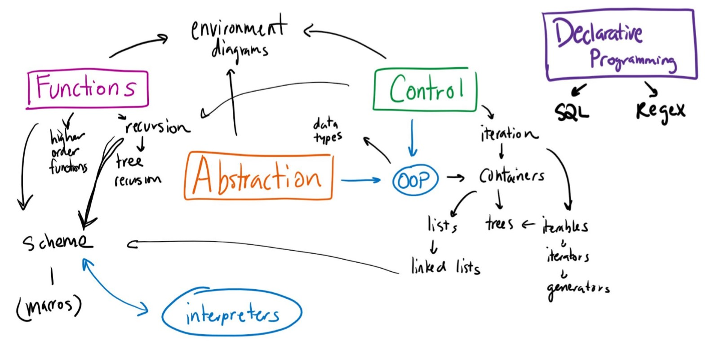

## Introduction

> [!warning] Warning
>
> This page was originally written in Spring 2023. It is likely outdated. Please ask your TA for the latest information!

Being the largest course at Berkeley, CS 61A has a *lot* of existing resources- not to mention John DeNero's recorded lectures are everything you could ever hope for in a lecture. I just don't see how I could contribute any meaningful content note that hasn't been done extremely well multiple times already.

Instead, I want to make a space where you can more easily find all of those resources, share some thoughts about my time TAing for 61A, and provide some dialogue about critical skills not taught in 61A but are necessary for succeeding in the CS major and software engineering.

## The important bits of 61A

CS61A is not really an intro CS class in that it moves *way* too quickly for someone who has never seen any of the concepts covered. This is, by design, a difficult truth of the matter: if you're not prepared for 61A (where it's assumed you've already seen much of the content), you're probably also not prepared for future CS classes that have an even larger amount of more conceptually difficult content.

Even as someone with prior experience, it's easy to get swept up and overwhelmed by the pace. If you're experiencing this, my advice is this:

**Don't get hung up on every detail- you don't need to understand everything perfectly, just the most important concepts.** I didn't feel comfortable with 61A content until teaching it for the 3rd or 4th time, and you probably only have one go at it!

Here's a list of things I think is worth paying attention to, and why you should pay attention to them:
 - **ABSTRACTION:** If there's one word that should be burned into your memory after 61A, it's this. Abstraction is a concept that we take entirely for granted as computer scientists and software engineers- hopefully 61A helps you appreciate why we can't live without it.
 - **Recursion:** Recursion's really weird when you first learn about it- how can you make something call itself and somehow do a useful thing? Yet, recursion is found everywhere, from the lowest levels of computer architecture (61C) to the latest theory (CS70, CS170, etc).
 - **Learning new programming languages quickly:** 61A takes you between two or more languages in a fraction of time most people learn a single one. In future courses, learning new languages is a skill you're assumed to have built up from this experience: for example, 61B makes you learn Java in a week, and CS161 plops an entire project on you in Golang without formal instruction on how to use it. Pay attention to what skills you can carry over from Python, and figure out what helps you pick up new syntax faster (make make a cheat sheet).
 - **Environment diagram intuition:** You will probably never use an environment diagram after 61A/B, but the hope is that getting really good at making them will help you think more like a computer and understand which structures/algorithms are more efficient. Being able to reason through each step of an environment diagram (and maybe deriving the rules without memorizing them) are skills that will carry over to many aspects of computer science.

## Taking advantage of resources

> [!summary] Resources Page
> 
> Go [here](/cs61a/resources) for a list of resources!

Due to the large size of the class, it might be hard to navigate the massive but often limited network of resources available (long OH queues, lots of people asking questions at lecture, etc.). 

Here's some tips that helped myself as well as many of my past students who needed extra support:
 - **Ask your TA for help!** TA's are available by email, during OH, or often right before/after discussion. You're welcome to ask them conceptual questions as well as consult them on your particular situation in the class. (Please be considerate of their time though- we're often not paid for the time we spend answering student questions outside of office hours, though we're almost always happy to help when we can!)
 - **Sign up for CSM sections!** CSM is an incredible resource that gives you free access to a tutor. Sections can range anywhere from 1 to 6 people in size, so you're usually able to find the size that works for you.
 - **Go to lab sections!** There's a lot of support in lab sections, and if it's not too busy, you're usually welcome to ask non-lab questions (such as for homework, practice exams, or content). It's a nice space to get work done and have shorter queue times compared to general office hours.
 - **Take good notes!** Taking notes during lecture, lab, and discussion will help you pay closer attention to the content, and have something to look back at when creating your cheat sheet for exams. As an added bonus, maybe you can put them online afterwards and help others :)

## Exam Tips

Unfortunately, only attending class and completing assignments is still not quite enough to guarantee success on exams. Make sure you're getting additional practice!

> [!summary] Exam Tips Page
> 
> Go [here](/cs61a/midterm-tips) for my test-taking tips!

## How and why you should teach 61A

Being a student at Berkeley gives you the pretty unique opportunity to teach (and maybe even run) an official course for thousands of students while still being an undergrad.

While teaching is definitely not for everyone, it can be an excellent motivator while you're still taking the course to do well-- striving to understand the content well enough to teach it will get you really good with the concepts at hand.

CSM and the AI program both do a great job of lowering the bar of entry for those interested in teaching. If you're sufficiently motivated and have a good grasp of the material, you have an excellent shot at trying it out.

### What's the process for becoming a TA?

The path to becoming a TA is different for everyone, but this is probably the most common path:
1. Take the class you want to teach, and do well in it. (Don't worry if you don't- there will be plenty more classes to ace!)
2. In the semester after, apply to be an AI or a CSM Junior Mentor (applications will be announced at the beginning of the semester in the class forum as well as EECS 101). It might take a semester or two to get accepted due to the demand, but be patient and seek out opportunities in other courses as well!
3. Either before, during, or after AI/CSM, you can also take CS 370 to improve your pedagogical skills, get more experience with teaching, and stand out among other candidates for teaching positions.
4. Apply for tutor or reader positions for any classes you'd like to teach (applications will be announced on EECS101 as well, typically due in October/November for Spring, Feb/March for Summer, March/April for Fall). Applying for summer sessions is generally the least competitive, since many existing TA's will probably be interning or doing something else over the summer.
5. Once you're on course staff, it's generally a matter of time and interest before you become a TA (or head TA).