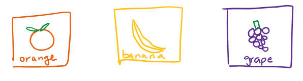

## What is inheritance?

Essentially, it's a way of putting similar objects together to **generalize behavior.** Inheritance is best used with relating **subtypes** to larger categories. For example, an :tangerine:orange **is a** fruit (so it's a **subtype** of fruit).

Let's say that a supermarket named _Jrader Toe's_ asks us to simulate fruits for them in an online system. We could do it like this:



Now, every fruit would need some of the same properties- like cost, weight, and name! So we would need to do something like:

```java
public class Orange {
    private String name = "Orange";
    private int cost;
    ...
    public Orange(int cost, ...) {
        this.cost = cost;
        ...
    }
    // lots of methods
    public String getName() { ...
```

This would be _really annoying_ to do for every single fruit. And they're all the same properties for every fruit so it would also be incredibly inefficient code-wise. **Inheritance gives a much better solution!**

Let's make a **Fruit** class and have all of our fruits **inherit from** that class.

.png>)

This does amazing things because we can just create one single Fruit class that has all of the properties we need, and simply make our specific fruits inherit those properties. (Side note: making multiple things inherit from one generic interface like this is called **polymorphism.**)

```java
public class Fruit {
    private String name;
    private int cost;
    ...
    public Orange(String name, int cost, ...) {
        this.name = name;
        this.cost = cost;
        ...
    }
    // lots of methods
    public String getName() { ...
}

// Now for a very simple Orange method!
public class Orange extends Fruit {
    public Orange(int cost,...) {
        super("Orange", cost, ...);
    }
}
```

With only those 4 lines, :tangerine:Orange now has all of the same methods and properties that Fruit has!

## Implementation Inheritance ("Extends")

You may have noticed the `extends` keyword being used to specify that an object **inherits** from another object. This is called **implementation inheritance** since an object takes all of the behaviors from its parent and can use them like its own.

When `extends` is used, these are the things that are inherited:

* All instance and static variables that are **not private** (see [Access Control](access-control.md) for more information)
* All non-private methods
* All nested classes

These are **not** inherited:

* Any **private** variables and methods
* All constructors


> [!info] **Quick sidenote!**
> 
> All objects automatically extend the `Object` class whether you like it or not. See [References, Objects, and Types in Java](objects.md) for more about this behavior.

### Constructor magic 🏗

When an object `extends` another object, its constructor will **automatically call the parent's constructor.** However, this does have some limitations:

* It will only call the **default** (no-argument) constructor in the parent.
* Calling the constructor is the **first thing that is done** in the child constructor.

But what if we want to call another constructor? That's where the `super` keyword comes in! When `super` is called, Java will know to **not** call the default constructor anymore. Here's an example:

```java
public class Parent {
    public Parent() {
        System.out.println("Default constructor");
    }
    public Parent(String say) {
        System.out.println(say);
    }
    void doStuff() { ... }
}

// Child inherits doStuff(), but not the constructors.
public class Child extends Parent {
    public Child() {
        System.out.println("Child")
    }
    public Child(String say) {
        super(say);
    }
}
    
public static void Main(String[] args) {
    Child c1 = new Child(); // will print "Default constructor" then "Child" !!!
    Child c2 = new Child("Hi"); // will print "Hi"
}
```

## Method Overriding

Let's say that _Jrader Toe's_ is running a promotion for 🍐pears and wants to make them 20% off normal pears! This poses a problem because **we want to inherit everything that normal pears have, but change only one behavior** (getPrice). Well I've got the solution for you!!! And it's called **overriding.**

```java
public class PromoPear extends Pear {
    public PromoPear(int cost, ...) {
        super(cost, ...);
    }
    
    // Overriding the getPrice to have a new behavior only for PromoPears!
    @Override
    public int getPrice() {
        return super.getPrice() * 0.8;
    }
    ...
}   
```

The `@Override` tag is technically optional, but it's highly suggested because it makes sure that you are indeed overriding something and not just making a new method! (Remember, it has to have the **same name and parameters as a method in one of its parents**.)

## **Method Overloading**

Sometimes, you want to take in **different parameters** into the **same method.** For instance, what if we wanted to create a method `getCount(Fruit fruit)` that counts how many fruits of that type we have? We might also want to allow users to pass in the name of the fruit to do the same thing- `getCount(String fruit)`. Java will allow us to make **both** of these methods in the same class!

However, this has some major downsides that should be considered.

* It's repetitive.
* It requires maintaining more code- changing one overload won't change the others!
* You can't handle any data types other than the ones you explicitly specify will work.

We'll discuss better solutions further down the page as well as in the [Generic Types](generics.md) page!

### How is overriding different from overloading?

They have very similar names but pretty different uses!

Overriding is for methods of the same name, **same parameters**, and **different classes.** If you can remember when you use the `@Override` tag, you can relate it back to this concept!

Overloading is for methods of the same name, **different parameters**, in the **same class**.

## Interfaces

Interfaces are like **blueprints 📘** for objects- they tell you what an object needs, but not how to implement them.

They are very similar to normal classes except for some major differences:

* **All variables are constants** (public static final).
* **Methods have no body**- just a signature (like `void doStuff();`)
* **Classes can inherit from multiple interfaces.**

Typically, interfaces will not have any implemented methods whatsoever. This limitation can technically be removed using the [default keyword](https://stackoverflow.com/questions/31578427/what-is-the-purpose-of-the-default-keyword-in-java/31579210), but this is **not recommended** because abstract classes handle this much better.

Here's an example of interfaces in the wild:

```java
public interface AnInterface<Item> {
  public void doStuff(Item x);
  public Item getItem();
  ...
}

public class Something implements AnInterface<Item> { // Note the IMPLEMENTS!
 @Override
 public void doStuff(Item x) {
     // implement method
 }

 @Override
 public void getItem() {
     // implement method
 }
}

public class MainClass {
  public static void main(String[] args) {
      AnInterface<String> smth = new AnInterface<>(); // ERROR!!
      // (new can't be used with interfaces.)
      AnInterface<String> smthElse = new Something<String>(); // Will not error!
      smth.getItem();
      ...
  }
}
```

## Abstract Classes

Abstract classes live in the place **in between** interfaces and concrete classes. In a way, they get the best of both worlds- you can implement whichever methods you want, and leave the rest as **abstract** methods (same behavior as interface methods)!

Here are some properties:

* **Variables behave just like a concrete class.**
* **Normal methods can be created like any other concrete class.**
* **Abstract methods** (`abstract void doSomething()`) **behave just like methods in interfaces.**
* Classes can only inherit from **one** abstract class.

Here's the same example from the interfaces section, but implemented using an abstract class.

```java
public abstract class AnAbstract<Item> {
  public abstract void doStuff(Item x);
  public abstract Item getItem();
  ...
}

public class Something extends AnAbstract<Item> { // EXTENDS, not implements!
 @Override
 public void doStuff(Item x) {
     // implement method
 }

 @Override
 public void getItem() {
     // implement method
 }
}

public class MainClass {
  public static void main(String[] args) {
      AnAbstract<String> smth = new AnAbstract<>(); // ERROR!!
      // (new can't be used with abstract classes, just like interfaces.)
      AnAbstract<String> smthElse = new Something<String>(); // Will not error!
      smth.getItem();
      ...
  }
}
```

.png>)

## Still not satisfied?

Watch [Josh Hug's video lecture](https://www.youtube.com/watch?v=IaEq\_fogI08\&list=PL8FaHk7qbOD6km6LlaHLWgRl9SbhlTHk2) about inheritance.

Or, move onto an advanced application of inheritance concepts, [Dynamic Method Selection](dynamic-method-selection.md).
