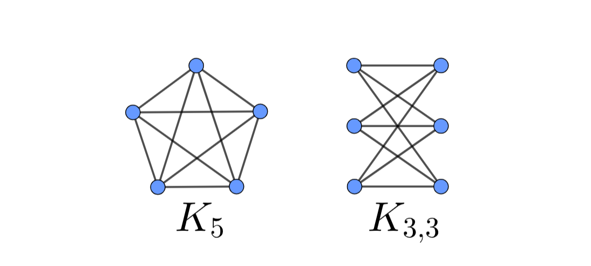

> [!info] Content Note
>
> This is a second introduction to graphs that assumes you've at least seen them before. Take a look at the [61B version](/cs61b/abstract-data-types/graphs) if you feel lost!

## What's a graph?

Formally, a graph is a **set of vertices with a set of edges connecting them.** A graph can be defined as $G = (V, E)$ where $V = \{A, B, \cdots V_n\}$ and $E = \{\{A, B\}, \{B, C\} \cdots \}$

For an **ordered graph** where vertices are numbered, $E$could be represented as a set of ordered pairs instead: $E = \{(A, B), (B, C) \cdots \}$

(Insert image of graph)

### Concepts and Definitions

A **neighbor** of a vertex is another vertex that is next to the original vertex. Formally u is a neighbor of v if $\{u, v\} \in E$.

An edge is **incident** to the two vertices that it connects

The **degree** of a vertex is the number of other vertices neighboring. If the graph is directed, the degree can be split into the **in-degree** (number of incoming connections) and the **out-degree** (number of outgoing connections).

* The sum of vertex degrees is equal to $2 |E|$.
  * Proof: Count the number of incidences. Each edge is incident to exactly two vertices, so the total number of edge-vertex incidences is $2|E|$(i.e. two times the number of edges).
  * The degree can also be defined as the number of incidences corresponding to a particular vertex v. Therefore, the total incidences is the sum of all degrees for all vertices!

A **path** is a sequence of edges. These edges must be connected, i.e. a path could be $(v_1, v_2), (v_2, v_3), (v_3, v_4)$.

* If there are $k$vertices, then a path should have $k-1$edges!

A **cycle** is a special path that begins and ends on the same vertex.

* Unlike a noncyclic path, there should be the same number of vertices as edges in a cycle.

A **walk** is a sequence of edges that could possibly repeat a vertex or edge.

A **tour** is a walk that starts and ends on the same vertex. Additionally, it cannot have any repeated edges.

* An **Eulerian walk** is a walk that uses **every edge** exactly once.
  * Doesn't require all vertices to be connected! There could be an isolated vertex with 0 degree.
* An **Eulerian tour** is a tour that visits **every edge** in a graph exactly once**.**
  * Theorem: any undirected graph has an Eulerian tour if and only if all vertices have **even degree** and is connected.
  * Proof: You need to use two incident edges every time you visit a node (to enter and leave). So when you enter, you need another edge to be able to leave! If a vertex has an odd number of edges, then you get stuck on that vertex with nowhere to go once you visit it.

Here's a handy summary, adapted from an explanation by [Dustin Luong](https://github.com/dstnluong):

|                          | end anywhere | start = end |
|--------------------------|--------------|-------------|
| repeated vertices ok     | walk         | tour*       |
| repeated vertices not ok | path         | cycle*      |

\*Eulerian if it uses each edge exactly once.

Two vertices $u$and $v$are **connected** if there exists a **path** between them.

* If all vertices are connected, then the graph is considered a **connected graph.**

A **complete graph** is a graph where every vertex is connected to every other vertex by exactly one edge. Complete graphs have some nice properties:

* Every vertex is incident to $n-1$edges (if there are $n$total vertices).
* The sum of all degrees is $n(n-1)$.

A **tree** is kind of like the opposite of a complete graph in that it has the **minimum number of edges** in order to ensure all vertices are connected ($v-1$ total edges). Here are some properties of trees, from a graph perspective (If you aren't already familiar with the recursive definition of trees, head over to the [61B guide](https://cs61b.bencuan.me/abstract-data-types/binary-trees) first to brush up on it!)

* Trees are **acyclic** and **connected.**
* **Leaves** are vertices that have degree 1.
* In a tree in which each parent node has 2 children, the **root** is a single vertex that has degree 2 and **non-leaf vertices** have degree 3.

## Hypercubes

A **hypercube** is a specific class of graphs that have highly connected vertices. In order to understand them better, let's start building some up:

Every hypercube has a dimension $n$. A 1-dimensional hypercube is simply a line (2 vertices connected by 1 edge). Not too exciting:

A 2-dimensional hypercube is a square (4 vertices connected by 4 edges). Still pretty familiar:

A 3-dimensional hypercube is a cube (8 vertices, 12 edges):

Now, let's get to the interesting stuff. How do we construct a 4-dimensional hypercube?? Well, let's figure out how we went from 2 to 3- we essentially **duplicated** the existing hypercube, then **connected corresponding vertices** (ones that are in the same relative position):

If we do this again for the 3-dimensional hypercube, we'll get this 4-dimensional hypercube, which has 16 vertices and 32 edges:

You might have noticed a pattern in how many vertices and edges a hypercube has. Here are those properties stated more formally:

* A hypercube has $2^n$vertices.
* A hypercube has $n2^{n-1}$edges.

Hypercubes are super useful, particularly for representing **bit strings.** If we have an $n$-dimensional hypercube, then we have enough vertices to represent all possible permutations of 1's and 0's of length $n$. Every edge would then represent the act of flipping exactly one bit.

## Planar Graphs

A **planar graph** is a graph that can be drawn without having two edges overlap.

**Euler's Formula** states that a connected planar graph has two more vertices and faces than the number of edges:

$
v + f = e + 2
$

Let's take a look at some examples to convince ourselves of how this works:

(A triangle has 3 edges and two faces: the inner face and outer face.)

(This shape is connected, but there is no enclosed face so the only face is the outer face.)

Another consequence of Euler's Formula is the inequality that holds for connected planar graphs:

$
3f \le 2e
$

This inequality states that any planar graph with 2 or more vertices must have at most 3 faces for every 2 edges. We know this because the smallest possible face is a triangle. If we plug this into Euler's Formula, we can eliminate one variable to get $e \le 3v - 6$. This makes it much easier to figure out if a graph is planar or not, since faces are often difficult to count.

### Proof of Euler's Formula

Let's use induction!

**Base Case:** Let there be 0 edges and 1 vertex. This means there's only 1 (outer) face as well. In this case, $v + f = 1 + 1 = 0 + 2$. This works!

**Induction Step:** \
Let's consider the case of a tree. Then, we know that there are always 1 fewer edges than vertices, and only one face:\
$v + 1 = (v-1) + 2$ works!

What about something that's not a tree? Well, things get a bit tricker here.

* Let's consider a graph:
* Now, let's start with the tree corresponding to the same number of vertices as the original:
* Now, we'll keep adding edges to enclose faces until we reach the number of edges in the original:
* We'll notice here that for every edge we add, a new face is created!
* Therefore, we can plug this fact into our inductive hypothesis (that Euler's formula works) to get $v + (f+1) = (e+1) + 2$.

### Nonplanar Graphs

Although nonplanar graphs don't share many of the nice properties planar graphs do, they're often more accurate representations of real life. They can also be used frequently in proofs to prove that a graph must either be planar or non-planar.

There are two famous non-planar graphs that are worth taking a look into:

#### K3,3

$K_{3,3}$is also known as the "utility graph" because of its connection to a popular puzzle: given 3 houses and 3 utilities (water, gas, electric), how can we draw a line connecting each house to every utility without having any of the lines cross?

I'll save you an amount of suffering by spoiling the answer: **this is an impossible task when done on a standard (planar) paper.** (Want topical entertainment? [Watch some youtubers solve this problem on a mug.](https://www.youtube.com/watch?v=VvCytJvd4H0)) This is because $K_{3,3}$is **non-planar**, so by definition at least one of the lines has to cross!

$K_{3,3}$is a **bipartite graph** since it has two groups of 3 vertices; and within each group, none of the vertices are directly connected to one another.

#### K5

$K_5$is the **complete graph** of 5 vertices. (This means that each vertex is connected to every other vertex.)

We can see that $K_5$has 5 vertices and 10 edges. Since we know that all planar graphs have $E \le 3V - 6$, we can show that $K_5$certainly isn't planar (since 10 is greater than 3(5)).

A striking fact: **ALL non-planar graphs contain either** $K_5$**or** $K_{3,3}$**!** This means that you can prove that a graph is either planar or nonplanar simply by showing that either of these component graphs can or cannot exist in a larger graph.

## Graph Coloring

A **graph coloring** assigns a color to each vertex such that **every edge has two different colors** on its two endpoints:

Often, we would like to figure out the **minimum number of colors** (categories) it takes to properly color a graph. This could have many uses, from [register allocation](https://en.wikipedia.org/wiki/Register\_allocation) to [solving sudoku puzzles](https://medium.com/code-science/sudoku-solver-graph-coloring-8f1b4df47072).

### Six Color Theorem

Let's propose that every **planar** graph can be colored with 6 colors or less.

From Euler's Formula, recall that $e \le 3v - 6$for any planar graph with more than 2 vertices. We also know that the degree of the graph is equal to $2e$.

So, the average degree of any given vertex is $\frac{2e}{v} \le \frac{2(3v-6)}{v} \le 6 - \frac{12}{v}$. This proves that there **exists** a vertex with degree at most 5 (due to the property of averages). Let's try removing this vertex and see what happens.

Well, now each of the 5 neighbors each are assigned a different color. If we add the vertex back, then it can assume the 6th color. We can use this proof inductively to show that adding any vertex will result in the same thing occurring.

### Five and Four Color Theorem

It turns out that 6 is actually not the tightest bound we can put on the number of colors needed! It is possible to color all **vertices** with **5 colors** or less and all **faces** with **4 colors** or less in a **planar graph**. I won't go into the details of these proofs here, but check out the bottom of [Note 5](https://www.eecs70.org/assets/pdf/notes/n5.pdf) for the proof of the 5 color theorem, and [Wikipedia](https://en.wikipedia.org/wiki/Four_color_theorem) has a good introduction to the \(highly technical\) 4 color theorem proof.

