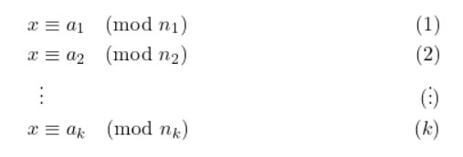

## What is Modular Arithmetic?

Modular arithmetic is "clock math" - that is, when numbers wrap around back to 0 if they get too big. You could think about it like a **remainder:** $21 \pmod{10}$ for example can be read as "what is the remainder of 21 when it is divided by 10?" (it's 1, by the way.)

This is an important concept in many aspects of computer science, namely [cryptography](/cs70/discrete-math/rsa-cryptography.md) and [error correction](/cs70/discrete-math/polynomials.md) among many others.

## Key Ideas

**If d divides x and d divides y, then d divides (y-x)**. $d \mid x, d \mid y \implies d \mid (y-x)$\
(Reminder: $a \mid b \iff (\exists q \in \mathbb{Z})(a = qb)$)

**Modular Equivalence:** If you're looking at a clock and it becomes 25:00, you know it's actually the same as 1:00. Even if they're technically not the same number, they can be treated the same way.

* More formally: **x is congruent to y modulo m:** $x \equiv y \pmod{m}$****

**Important Notation Distinction:** $x \pmod{m}$ is the **class of numbers** that follow the mod rule $m$. It can be used to write equivalences ($10 \equiv 21 \pmod{11}$). However, $\mod(x, m)$is just a number (the remainder when dividing x by m). $\mod(x,m) = x - \lfloor{\frac{x}{y}}\rfloor \cdot y$

**Greatest Common Denominator (GCD Mod Corollary):** Modular arithmetic can be used to identify an important property of the GCD, which is that $GCD(x,y) = GCD(x \mod y, y)$.

## Arithmetic

### Addition

Given that $a \equiv b \pmod{m}$, $a+c \equiv b+c \pmod{m}$. This result shouldn't be too surprising, and suggests that adding a constant value to both sides won't change the congruence, just like any other equation.

### Multiplication

Multiplication works pretty much how you'd expect it to work after seeing how addition works. Formally defined, if $a \equiv b \pmod{m}$, then $ka = kb \pmod{m}$. Intuitively, this means that if you want to multiply a big number, you can take the mod of the big number before multiplying it, and that will be equivalent to multiplying before taking the mod.

As an example, let's try to figure out what day it is in 8 years. We know that there will be 2 leap years with 366 days each, and 6 normal years with 365 days each. We don't really feel like computing $(365 \cdot 6) + (366 \cdot 2) \pmod{7}$, so we can instead take the mod of 365 and 366 first. This yields the much simpler expression $(1 \cdot 6) + (2 \cdot 2) \pmod{7} \equiv 1$. Therefore, the day in 8 years will be one day after today.

### Division and Inverses

In normal number spaces, the **multiplicative inverse** of x is a y such that $xy = 1$. This concept still applies to modular arithmetic!

If we have $x \pmod{m}$, then the multiplicative inverse is defined as a number y such that $xy = 1 \pmod{m}$.

For example, let's take a look at $4x = 5 \pmod{7}$. We can multiply both sides by 2 in order to get $8x = 10 \pmod{7}$. At this point, we can use the $\pmod{7}$to reduce the 8 into a 1 and the 10 into a 3, resulting in $x = 3 \pmod{7}$.

There are some values where it's impossible to get an equivalence into the form $1 \pmod{m}$. This usually happens when there is a common factor (like $8x \equiv y \pmod{12}$). In other words, **if the greatest common divisor of x and m is 1, then x has a multiplicative inverse modulo m. (x is relatively prime to y).**

## Algorithms

Now, let's explore three famous algorithms for computing useful information using modular arithmetic: **Euclid's Algorithm** for GCD and inverses, the **Chinese Remainder Theorem**, and **Fermat's Little Theorem.**

## Euclid's Algorithm

.png>)

**Euclid's Algorithm** is a recursive procedure for calculating the greatest common denominator. Remember that $GCD(x,y) = GCD(x \mod y, y)$ by the GCD Mod Corollary. We can prove that this works using induction:

* Base Case: If y is 0, then any value for x is the GCD since everything can divide 0 to get 0.
* Inductive Case: Proof of the GCD Mod Corollary.

This is a rather efficient algorithm: at every iteration, the value of x and y decrease dramatically- at least by a factor of 2. This makes it $\theta(\log_2(x))$(in other words, we need one division for each bit that is needed to represent $x$).

For an example of a computation, check out the Extended Algorithm section below (the computation is extremely similar).

### Using Euclid's Extended Algorithm for Inverses

Great! We got the GCD. So what?

Remember that **if the GCD of x and m is 1, then there is an inverse of x.** In more concrete terms, we can state **Euclid's Extended GCD Theorem (Bezout's Theorem)** as such:

$
ax + by = gcd(x,y)
$

In other words, the GCD can be written as a scalar multiple of x and y. Since we remember that the definition of the inverse is that $ax + by = 1$for some integers a and b, Euclid's Extended Theorem checks out for showing that the inverse exists if the GCD is 1.

.png>)

The process can be tedious to compute by hand, but here's a nice video that walks through that process:

<iframe
    width="640"
    height="480"
    src="https://www.youtube.com/embed/6KmhCKxFWOs"
    frameborder="0"
    allow="encrypted-media"
    allowfullscreen
>
</iframe>

## The Chinese Remainder Theorem

The **Chinese Remainder Theorem (CRT)** guarantees **existence and uniqueness** of a solution to a system of modular congruences. More formally stated:

There is a unique solution $x \pmod{mn}$such that $x = a \pmod{m}$, $x = b \pmod{n}$, and $gcd(m,n) = 1$. Here are a few ways to word it (see which one clicks better):

#### Formal Statement of CRT:

Let $n_1 \cdots n_k$be positive coprime integers. (Any two of them must be relatively prime.) Then, for any combination of integers $a_1 \cdots a_k$, a **unique** x exists such that $x \equiv a_i \mod n_i$for all $0 < i \le k$.

**Alternative Statement of CRT:**

Let $n_1, \ldots n_k$ be pairwise co-prime, i.e. $n_i$ and $n_j$ are co-prime for all $i \neq j$. The Chinese Remainder Theorem (CRT) tells us that there exist solutions to the following system of congruences:

#### Uniqueness of CRT Solution

Not only do we know that there is a unique solution $x$, but we can actually write out its exact value! Here it is:

$$
x = \sum_{i=1}^k a_i b_i \pmod{N}
$$

In this sum, $b_i = (\frac{N}{n_i}) \cdot (\frac{N}{n_i})^{-1} \mod n_i)$ , and $N$is the product of all primes $n_1, \cdots n_k$.  This sum is congruent to $a_i \mod n_i$for all valid values of $i$.

#### Computation

The Chinese Remainder Theorem often ties well together with the Extended Euclidean Algorithm, since we would need to find lots of inverse mods for each $b_i$. Also like the Extended Euclidean Algorithm, it's very hard to demonstrate the computation on a static webpage so here's another good video walkthrough!

<iframe
    width="640"
    height="480"
    src="https://www.youtube.com/embed/zIFehsBHB8o"
    frameborder="0"
    allow="encrypted-media"
    allowfullscreen
>
</iframe>

## Fermat's Little Theorem

**Fermat's Little Theorem** (not to be confused with [Fermat's Last Theorem](https://www.youtube.com/watch?v=nUN4NDVIfVI)) makes the observation that **exponentiation is periodic** when modulo is done by a **prime number.** This makes it reasonable to compute obscenely large numbers, like $2^{65535}$, when in a mod space.

#### The Formal Definition

For prime $p$ and an integer $a \in \{1, 2, \cdots, p - 1\}$, $a^{p-1} \equiv 1 \pmod{p}$.

#### An Alternative Definition

If we multiply both sides by $a$, we can actually drop the restriction to $a$ and allow it to be any integer. This version is sometimes more useful than the normal definition:

For prime $p$ and any integer $a$, $a^p \equiv a \pmod{p}$.

For an application of Fermat's Little Theorem, head over to [RSA Cryptography](/cs70/discrete-math/rsa-cryptography.md)!

